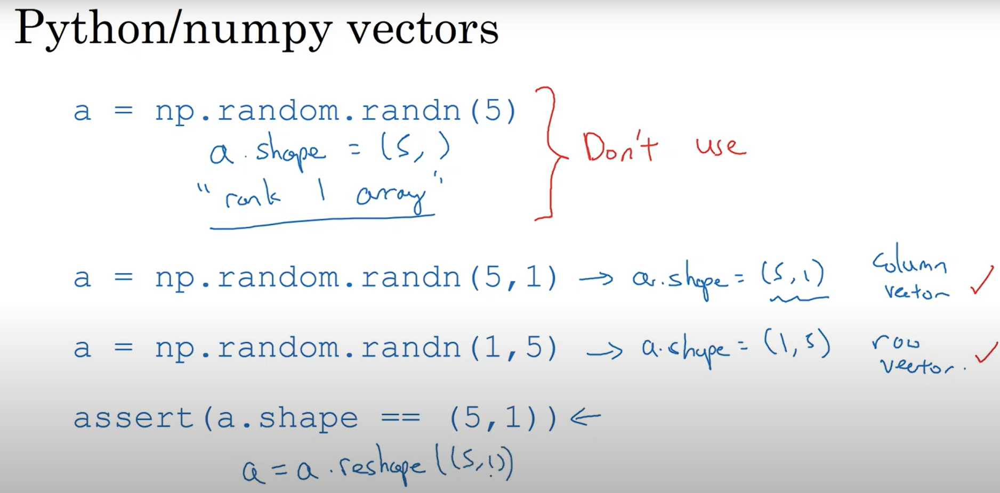

* content
{:toc}

# Notes from Andrew Ng's Neural Networks and Deep Learning Course
Commit to use explicit declarations of vectors and matrices in numpy. This will help you avoid bugs and make your code easier to understand.

# References
- [Andrew Ng's Neural Networks and Deep Learning Course](https://www.coursera.org/learn/neural-networks-deep-learning)